  
  
  
  

  Software &amp; creative developer from <b>Romania</b>, based in the <b>Netherlands</b>. 
  I design and build websites, web apps and Windows tools, from the first sketch to the last pixel and the release.

 

### [AxisNex](https://github.com/wlt1920/AxisNex) &nbsp;·&nbsp; Windows app · released · auto-updates

A free Windows app for controller tuning and calibration. A 15-second calibration fixes stick drift, a live before/after view shows exactly what changes, profiles can be shared as a file, and the controller's own lights and sound react to what you do. Designed, built and released end to end: installer, built-in updates and 11 languages.

&nbsp; **[Download →](https://github.com/wlt1920/AxisNex/releases/latest)** &nbsp; **[What's new →](https://github.com/wlt1920/AxisNex/blob/main/CHANGELOG.md)**

 

<table>
  <tr>
    <td width="50%" valign="top">
      
      <h3><a href="https://github.com/wlt1920/wltziff-portfolio">wltziff.nl</a></h3>
      My portfolio: a WordPress theme written from scratch, with live Spotify, YouTube and GitHub data, reviews and privacy-first analytics.  
      
      
      
      
    </td>
    <td width="50%" valign="top">
      
      <h3><a href="https://github.com/wlt1920/wltziff-analytics">wltziff Analytics</a></h3>
      A privacy-first analytics dashboard built into my site: visitor journeys step by step and a click map on the real page. No Google Analytics, no IP addresses, no third parties.  
      
      
      
      
    </td>
  </tr>
</table>

 

<table>
  <tr>
    <td width="33%" valign="top">
      <b><a href="https://wltziff.nl/projects/viotaxi/">VioTaxi ↗</a></b> 
      CLIENT · WEBSITE  
      A fast, mobile-first site for a Dutch taxi company, with online booking and fixed tariffs.  
      <code>WordPress</code> <code>Custom theme</code>
    </td>
    <td width="33%" valign="top">
      <b><a href="https://wltziff.nl/projects/lvminna/">LVMINNA ↗</a></b> 
      CLIENT · E-COMMERCE  
      A complete online store for a luxury candle brand from Groningen.  
      <code>WooCommerce</code> <code>ACF</code>
    </td>
    <td width="33%" valign="top">
      <b><a href="https://wltziff.nl/projects/stemvrij/">StemVrij ↗</a></b> 
      AI · LOCAL APP  
      Local, private AI app that splits music into vocals and instrumentals, with waveforms, a mixer and export.  
      <code>React</code> <code>Vite</code> <code>FastAPI</code> <code>Demucs</code>
    </td>
  </tr>
</table>

Also: a horror game in Unreal Engine, a YouTube channel and music · <a href="https://wltziff.nl/projects/"><b>everything on wltziff.nl →</b></a>

 

   
  

  <b>Build</b> · HTML, CSS / SCSS, JavaScript, PHP, React, Node.js, Python, C# / .NET 
  <b>Platforms</b> · WordPress, WooCommerce, MySQL 
  <b>Interface &amp; motion</b> · Figma, Tailwind CSS, GSAP, Swup, Swiper 
  <b>Workflow</b> · Git, GitHub, AI-assisted development (Claude, Codex, ChatGPT) 
  <b>Languages</b> · Romanian (native) · English (fluent) · Dutch (fluent) · Spanish (learning)

 

  <a href="https://wltziff.nl"><b>wltziff.nl</b></a> &nbsp;·&nbsp;
  <a href="https://www.linkedin.com/in/walter-argint-636b53263/"><b>LinkedIn</b></a> &nbsp;·&nbsp;
  <a href="mailto:wltcollabs@gmail.com"><b>wltcollabs@gmail.com</b></a>

